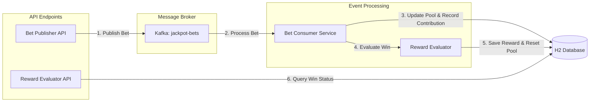

# Jackpot System

This project is a **Spring Boot microservice** designed to handle and evaluate live jackpot events triggered by betting activities. The core responsibilities include:

- Providing REST endpoints to publish incoming bets.
- Consuming these bets asynchronously via an Apache Kafka topic (`jackpot-bets`).
- Executing dynamic mathematical strategies to determine the contribution to the pool and evaluate if the bet triggers a reward payout.
- Exposing endpoints to verify the win status of processed bets.
- Guaranteeing reliability through extensive unit tests.

---

## Architecture & Workflow



### Bet Publisher Flow
**Data Fields**: Bet ID, User ID, Jackpot ID, Stake Amount

**Execution Steps**:
1. Intercept the incoming request and perform basic authorization validations.
2. Publish the event payload to the `jackpot-bets` Kafka topic.

**Validation Rules**:
* User should be authorized to access the system (Not implemented) 
* Jackpot ID must exist within the platform.
* The stake amount must be strictly greater than or equal to 1.
* A specific Bet ID must be uniquely tied to a User/Jackpot combination to prevent duplicates.

### Bet Consumer Background Task
**Execution Steps**:
1. Sequentially pull new bet records from the Kafka topic.
2. Retrieve the relevant jackpot configurations (contribution logic) and the current pool size from the H2 Database.
3. Compute the amount to add to the pool based on the configured strategy:
  * **Fixed Strategy**:
    * `Total Contribution = (Stake) * (Fixed Percentage)`
  * **Variable Strategy**: 
    * Calculates progress ratio: `(Current Pool - Start Amount) / (Max Pool - Start Amount)`
    * Interpolates percentage: `Max Percentage - Progress Ratio * (Max Percentage - Min Percentage)`
    * `Total Contribution = (Stake) * (Interpolated Percentage)`
4. Persist the generated record into the `jackpot_contribution` table and overwrite the previous `current_amount` in the main `jackpot` entity.

### Reward Evaluation Engine

> **Design decision**:
> Reward evaluation is performed during Kafka bet processing. Each bet is evaluated exactly once after its jackpot
> contribution is calculated, and the result is persisted. The reward API returns the persisted evaluation result 
> rather than performing a new evaluation.  
> This avoids ambiguity caused by delayed or concurrent reward requests and ensures that each bet is evaluated against
> the jackpot state at the time of processing.
> 
> Alternative considered: Reward evaluation could instead be performed when the reward API is called. In that model, the API would need to handle concurrent requests for bets belonging to the same jackpot and ensure that only one request can claim and reset the jackpot. Additional state management or locking would therefore be required to define how pending bets are handled after a jackpot is awarded.

**Execution Steps**:
1. Pull the active reward logic configurations from the database.
2. Determine the likelihood of winning:
  * **Fixed Method**:
    * `Win Probability = Configured Probability %`
  * **Variable Method**:
    * Compute scaling ratio: `(Current Pool - Start Amount) / (Max Pool - Start Amount)`
    * `Win Probability = Minimum Probability + Ratio * (100 - Minimum Probability)`
3. Process the payout logic: 
  * Trigger a **WIN** if an internal random generator hits below the probability threshold.
  * Register a **LOSS** otherwise.
4. On a successful win:
  * Insert a new ledger entry into the `jackpot_reward` table.
  * Reset the live `current_amount` back to the configured `initial_amount` within the `jackpot` table.

### Reward Evaluator API
**Data Fields**: Bet ID, User ID, Jackpot ID

**Execution Steps**:
1. Query the `jackpot_reward` ledger using the provided keys.
2. If no record is found, the user lost (returns 0 ).
3. If a record exists, return the payout details:  Payout Amount

**Validation Rules**:
* The User ID, Bet ID, and Jackpot ID are validated against the live database before querying.
* User should be authorized to access the system (Not implemented)

---

## Database Schema

### `jackpot`
**Unique Key:** `id`

| Column | Type | Nullable | Description                                        |
|---|---|---|----------------------------------------------------|
| `id` | varchar(64) | No | Unique identifier for the jackpot                  |
| `name` | varchar(255) | No | Name of the jackpot                                |
| `initial_amount` | decimal(15,2) | No | Base pool value                                    |
| `current_amount` | decimal(15,2) | No | Current accumulated pool value available to be won |
| `created_at_date` | timestamp | No | Timestamp when the jackpot was created             |
| `updated_at_date` | timestamp | No | Timestamp when the jackpot was updated             |


### `jackpot_contribution_configuration`
**Unique Key:** `jackpot_id`

| Column | Type | Nullable | Description |
|---|---|---|---|
| `id` | Integer | No | Internal unique ID |
| `jackpot_id` | varchar(64) | No | Primary key of Jackpot |
| `strategy_type` | varchar(32) | No | Fixed/Variable |
| `start_amount` | decimal(15,2) | Yes | Base pool value |
| `max_amount` | decimal(15,2) | Yes | Ceiling pool amount for variable decay |
| `contribution_pct` | decimal(15,2) | No | Fixed % OR Initial starting % for Variable |
| `min_contribution_pct` | decimal(5,2) | Yes | Floor % for Variable (as pool approaches max_amount) |


### `jackpot_reward_configuration`
**Unique Key:** `jackpot_id`

| Column | Type | Nullable | Description |
|---|---|---|---|
| `id` | Integer | No | Internal unique ID |
| `jackpot_id` | varchar(64) | No | Primary key of Jackpot |
| `strategy_type` | varchar(32) | No | Fixed/Variable |
| `start_amount` | decimal(15,2) | Yes | Base pool value |
| `max_amount` | decimal(15,2) | Yes | Pool limit where chance becomes 100% |
| `reward_probability_pct` | decimal(5,2) | No | Fixed chance % OR Initial starting % for Variable |


### `jackpot_contribution`
**Unique Key:** `bet_id`, `user_id`, `jackpot_id`

| Column | Type | Nullable | Description |
|---|---|---|---|
| `id` | bigint | No | Internal unique ID |
| `bet_id` | varchar(64) | No | Unique ID of the bet that triggered this contribution |
| `user_id` | varchar(64) | No | Unique ID of the user who placed the bet |
| `jackpot_id` | varchar(64) | No | Primary key of Jackpot |
| `stake_amount` | decimal(15,2) | No | Original bet amount placed by the user |
| `contribution_amount` | decimal(15,2) | No | Calculated monetary amount added to the pool |
| `current_jackpot_amount` | decimal(15,2) | No | Total jackpot pool amount immediately after this contribution |
| `created_at_date` | timestamp | No | Timestamp when the contribution occurred |


### `jackpot_reward`
**Unique Key:** `bet_id`, `user_id`, `jackpot_id`

| Column                  | Type | Nullable | Description |
|-------------------------|---|---|---|
| `id`                    | bigint | No | Internal unique ID |
| `bet_id`                | varchar(64) | No | Unique ID of the bet that won the jackpot |
| `user_id`               | varchar(64) | No | Unique ID of the winning user |
| `jackpot_id`            | varchar(64) | No | Primary key of Jackpot |
| `jackpot_reward_amount` | decimal(15,2) | No | Total reward amount paid out to the user |
| `created_at_date`       | timestamp | No | Timestamp when the reward was granted |

---

## Technology Stack

- Java
- Spring Boot
- Apache Kafka 
- H2 In-Memory Database (via Spring Data JPA)
- KafkaTemplate
- JUnit 5 + Mockito

---

## Setup & Execution

### 1. Requirements

- Java 17 or higher runtime 
- Docker engine (for running Kafka locally)
- Maven build tool

---

### 2. Kafka Initialization

We utilize the standard [apache/kafka](https://hub.docker.com/r/apache/kafka) container image.

#### a. Start the Broker

```bash
docker run -p 9092:9092 -d --name broker apache/kafka:latest
```

#### b. Provision the Topic

Once the container is healthy, provision the `jackpot-bets` topic:

```bash
docker exec -it broker /opt/kafka/bin/kafka-topics.sh --create \
  --topic jackpot-bets \
  --bootstrap-server localhost:9092 \
  --replication-factor 1 \
  --partitions 3
```

---

### 3. Application Deployment

Compile and boot the Spring service via Maven:

```bash
mvn clean install
mvn spring-boot:run
```

The application will bind to port `8080` by default.

---

### 4. Running the Test Suite

Execute the JUnit suite to verify system integrity:

```bash
mvn test
```

---

## API Specification

### `POST /jackpot-service/bets`

Asynchronously submits a bet to the internal event pipeline.

**Payload Structure:**

```json
{
  "betId": "bet-123",
  "userId": "user-123",
  "jackpotId": "jackpot-xyz",
  "stakeAmount": 50.00
}
```

**Supported Status Codes:**

- `200 OK` – Accepted into processing queue
- `400 Bad Request` – Request failed internal validation constraints
- `500 Internal Server Error` – Broker connection or persistence failure

---

### `GET /jackpot-service/rewards/evaluate`

Synchronously queries the ledger to check if a specific bet yielded a jackpot win.

**Query Parameters:**

- `betId` (string, required)
- `userId` (string, required)
- `jackpotId` (string, required)

**Example Request:**
`GET /jackpot-service/rewards/evaluate?betId=bet-123&userId=user-123&jackpotId=jackpot-xyz`

**Expected Response:**

```json
{
  "jackpotRewardAmount": 5000.00 
}
```

---

## Design Philosophy & Special Conditions

### 1. Thread Safety & Locking
- **Condition:** Multiple bets update the same jackpot at the same time. 
- **Handling:** Used `@Lock(LockModeType.PESSIMISTIC_WRITE)` to lock the database row. This ensures updates happen one by one and the math is always correct.

### 2. Duplicate Message Prevention
- **Condition:** Kafka redelivers a message or a client retries a bet.
- **Handling:** The system checks if the `betId` and `userId` already exist in the database before processing. If it exists, the duplicate is ignored.

### 3. Kafka Reliability
- **Condition:** Kafka broker goes offline or is very slow.
- **Handling:** The `POST /bets` endpoint has a 5-second timeout. If Kafka does not respond in 5 seconds, it returns an error so the system does not hang.

### 4. Missing Configuration Handling
- **Condition:** A bet uses a deleted Jackpot ID or the configuration is missing.
- **Handling:** The service logs the error instead of throwing it back to Kafka. This stops Kafka from retrying the failed message forever.

### 5. Strategy Pattern
- **Condition:** Future changes require new reward or contribution math.
- **Handling:** Used the Strategy Pattern. New math rules can be added as new classes without changing the main Kafka consumer code.

### 6. Configuration Caching
- **Condition:** For every bet processing configuration needs to be retrieved from the DB.
- **Handling:** Introduced cache at Contribution Configuration and Reward configuration level, to avoid un-necessary DB call. TTL is not added at this cache level as assumption is that configuration should not get changed for consistency. But if system demand otherwise then eviction policy can be added during configuration update.

### 7. Dead Letter Queue (DLQ)
- **Condition:** A severe infrastructure error occurs (like a missing jackpot config) during async bet processing.
- **Handling:** Instead of indefinitely throwing the exception back to Kafka (poison pill) or completely dropping the bet, the consumer pushes the raw `BetRequestDto` directly to the `jackpot-bets-dlq` Kafka topic. This guarantees no financial data is ever lost and allows operations to manually replay the bets once the system is fixed.

---

## Assumptions & Key Architecture Decisions

### 1. Custom Database Schema Design
- **Assumption:** The original requirements did not dictate a specific schema for managing jackpots or tracking historical win logic.
- **Decision & Reasoning:** I have added database schema for jackpot management (including `jackpot`, `jackpot_contribution_configuration`, and `jackpot_reward_configuration`). This was done to make the system highly dynamic. Rather than hardcoding fixed percentages or thresholds into the Java code, the system reads from these custom tables. CRUD on the Jackpot entity is not implemented as part of this assignment. Any alteration needs to be handled via queries only.
### 2. User Authentication (Out-of-Scope)
- **Assumption:** Authentication and authorization mechanics are handled upstream.
- **Decision & Reasoning:** The system assumes that an external API Gateway or Identity Provider intercepts and validates user tokens before routing traffic to this microservice. The service blindly trusts the `userId` passed in the payloads, provided it passes basic structural validation (e.g., not null).
### 3. Jackpot Management (Out-of-Scope)
- **Assumption:** Jackpot addition/ updation/ removal via API
- **Decision & Reasoning:** As it is not must have thing for the assignment, only database schema is added.
### 4. Contribution logic
- **Assumption:** Right now only two types are considered : FIXED and VARIABLE (Linear)
- **Decision & Reasoning:** The main aim was to showcase the system design and functions for different types of strategies. Other strategies can be added by adding factory impl and right now configurations are also considered to fit in the current Database structure, if it changes then json based configuration table can be introduced for any further enhancements.
### 5. Currency
- Right now no conversion is added, everything is assumed in one currency.

##  Future Enhancements
- DB-level Audit Logging
- Fetch/list APIs of entities with pagination
- Global exceptional handler
